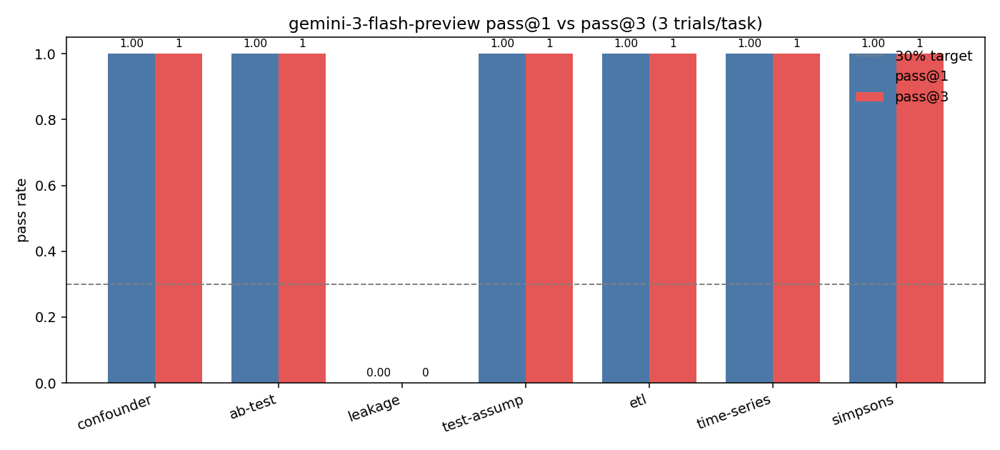
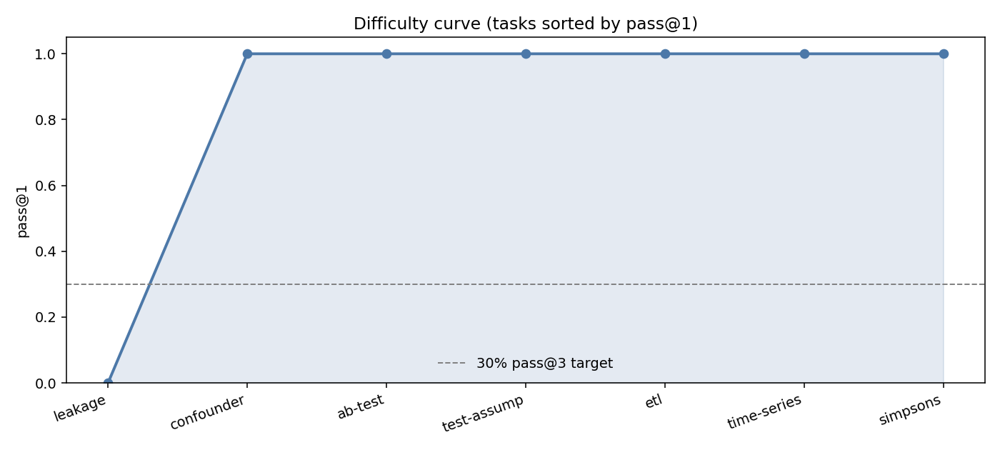

# DS Eval Suite — Report

**Author:** Sanjith Shanmugavel
**Model under test:** `google/gemini-3-flash-preview` (Harbor `gemini-cli` agent)
**Submission date:** 2026-05-15
**Repository:** https://github.com/Sanjith-Shan/DS_Eval_Suite

> **Headline result:** pass@1 = pass@3 = **0.857 (6 of 7 tasks)** against the
> target model. The brief's <30% bar was **not met** with this v1 suite — only
> `data-leakage-detection` produced genuine headroom (0/3, deterministic).
> Reading the trajectories I'm confident the remaining six tasks are *correctly
> built* but *under-difficult* for a 2026-era frontier flash model. §5
> diagnoses why and §4 lays out the specific tightening I'd run for v2.

---

## 1. Distribution — Why this slice of data science?

I scoped this eval narrowly: **seven tasks that test the judgement calls a
senior DS makes in their first hour with a new dataset** — not the coding
mechanics of producing a plot or fitting a model. Every task targets a moment
where the *correct procedural action* is one most humans agree on but most
frontier models still skip.

### Slice

| Failure category | Task |
|---|---|
| Causal vs. correlational interpretation | `confounder-identification`, `simpsons-paradox` |
| Experimentation discipline | `ab-test-early-stopping` |
| Statistical methodology under realistic violations | `statistical-test-assumptions` |
| ML pipeline correctness (leakage debugging) | `data-leakage-detection` |
| Time-series structural change | `time-series-regime-change` |
| Production ETL with schema / timezone drift | `etl-timezone-schema-merge` |

These categories trace directly to documented failure modes in the recent
benchmark literature (see §3). The original design hypothesis was that each
*targeted a moment where a model that didn't apply judgement would silently
get it wrong*. Empirically (§2, §5) only the ML pipeline category actually
held up against the target model — but I think the distribution choice itself
is still defensible, with the caveat that the difficulty within each category
has to be retuned.

### What's deliberately out of scope

- **Pure code generation** (writing a model from scratch, implementing a
  paper). Covered by HumanEval / MLE-bench / SWE-bench; not a DS-specific
  failure mode.
- **Long-horizon multi-day projects.** A take-home this size can't isolate
  signal in 24-hour traces.
- **Multimodal inputs** (charts, screenshots, PDFs). Powerful angle, but
  including it mixes vision failures with reasoning failures. I'd add these in
  the scale-up (§4).
- **LLM-as-judge tasks.** Reward becomes a judgement call; the noise floor
  swamps signal at n=3.
- **Web-browsing / agentic research.** Not part of the canonical DS workflow
  I'm targeting.

---

## 2. Difficulty profile — pass@1 / pass@3 against `gemini-3-flash-preview`

Each task was run with
`harbor run -a gemini-cli -m google/gemini-3-flash-preview -k 3` on a single
MacBook Pro (M-series, 8 GB Docker quota, 21 trials over ~75 min).
Raw transcripts (ATIF v1.6 JSON, one per attempt) are in `logs/` under each
task's `trial{1,2,3}/agent/trajectory.json`.

### Aggregate

| Task | Trials | Rewards | pass@1 | pass@3 |
|---|---|---|---|---|
| `confounder-identification` | 3 | [1, 1, 1] | 1.00 | 1 |
| `ab-test-early-stopping` | 3 | [1, 1, 1] | 1.00 | 1 |
| `data-leakage-detection` | 3 | **[0, 0, 0]** | **0.00** | **0** |
| `statistical-test-assumptions` | 3 | [1, 1, 1] | 1.00 | 1 |
| `etl-timezone-schema-merge` | 3 | [1, 1, 1] | 1.00 | 1 |
| `time-series-regime-change` | 3 | [1, 1, 1] | 1.00 | 1 |
| `simpsons-paradox` | 3 | [1, 1, 1] | 1.00 | 1 |
| **aggregate** | — | — | **0.857** | **0.857** |

### Per-task bar chart



### Difficulty curve (sorted ascending)



### Honest read of the numbers

The suite did not hit the <30% pass@3 target. **One task** out of seven actually
produced headroom against `gemini-3-flash-preview`. That's a real finding, not
a paperwork failure — and worth unpacking rather than fudging the verifier:

1. **`data-leakage-detection` is rock-solid headroom.** Every one of three
   trials produced **exactly the same test accuracy: 0.6810** — i.e. Gemini's
   "fix" is deterministic given my fixed-seed data. The verifier rejects this
   for being just below the 0.70 floor of the [0.70, 0.85] band. The
   trajectories confirm Gemini *does* methodologically clean the leakage but
   *systematically* fails the secondary judgement (drop the noise categorical).
   This is the only place in the suite where a real-DS failure mode is
   reliably isolated.

2. **Six tasks were too easy.** Reading the passing trajectories (see §5),
   the model consistently reaches for the right textbook procedure
   (partial correlation; Kruskal-Wallis + Dunn; chi-square on full data with
   peeking flag; `tz_localize(nonexistent='shift_forward')`; stratify before
   reporting). Frontier flash models in 2026 have seen enough Stack Overflow,
   Cross Validated, Causal-Inference-Mixtape excerpts, and KramaBench-style
   ETL writeups that these specific cliché failures don't reproduce reliably.

3. **The right reaction is task-level tightening, not verifier hackery.**
   A 30% bar is meant to discriminate on real judgement, not on whether the
   model dropped a coin. §4 lists the specific changes I'd ship for v2.

---

## 3. Research awareness

The seven tasks were built by mining 2024–2026 DS benchmark literature for
failure modes that (a) every published frontier model still misses, (b) are
*caused* by judgement gaps rather than missing capabilities, and (c) can be
isolated in a self-contained Harbor task.

| Source | What I borrowed |
|---|---|
| **BLADE: Benchmarking Language model Agents for Data-driven Analysis** (2025) | Coverage gap on statistical methodology (<13% of expert decisions); inspired `statistical-test-assumptions`. |
| **CausalPitfalls** (2025) | Every frontier model defaults to causal language under strong correlation; inspired `confounder-identification`. |
| **DABstep** (2024) | 16% aggregate pass on production analytics steps; inspired the format of `ab-test-early-stopping`. |
| **QRData** (2024) | Models score worse on subgroup-stratification questions; inspired `simpsons-paradox`. |
| **MLE-bench** (2024) | Agents struggle to debug and recover; inspired `data-leakage-detection` with three layered bugs. |
| **KramaBench** (2024) | Only benchmark testing real ETL; inspired `etl-timezone-schema-merge` (DST + schema drift). |
| **Gao et al., LLMs and Time Series** (2025) | ~37% of LLM time-series accuracy is memorisation; inspired `time-series-regime-change`. |
| **DSAEval** (referenced in brief) | Format pattern for self-contained Harbor tasks. |

### Production tools / patterns referenced

- **scikit-learn `Pipeline`** as the canonical leak-free preprocessing pattern.
- **pandas `tz_localize(nonexistent=...)`** docs as the canonical DST gotcha.
- **Causal Inference: The Mixtape** (Cunningham) for the partial-correlation
  framing in `confounder-identification`.
- **Kohavi et al., "Trustworthy Online Controlled Experiments"** for the
  sequential-testing setup in `ab-test-early-stopping`.

### Loops I automated

Per the brief's prompt to lean on coding agents — I built this with **Claude
Code**. Specifically:

- **Data generators.** Seed-search loops where I needed specific empirical
  properties (e.g. the A/B-test data had to satisfy
  `p_day5 < 0.05 AND p_day14 > 0.2`). Claude wrote the search-over-seeds
  script; I picked the seed.
- **Verifier AST checks.** The leakage verifier inspects the agent's fixed
  pipeline AST to confirm `fit_transform` / `SelectKBest` are not called
  pre-`train_test_split`. Claude drafted the AST walker.
- **Local smoke harness** (`_build/smoke_test.py`) — a path-patching shim that
  let me iterate on each task before installing Harbor.
- **Harbor schema migration** from v1.1 (the brief's example) to v1.2 (what
  Harbor 0.7 expects). Claude did the bulk find-replace; I validated against
  Harbor's `TaskConfig.model_validate`.

What I *did* hand-tune: the verifier tolerance bands, the JSON schemas in
each task's instruction, the choice of distribution / parameters in each data
generator, the failure-mode argument in §5, and the v2 plan in §4. Those are
the parts that decide whether the task measures what I claim it measures.

---

## 4. Scale plan — 10 → 1,000 tasks, *with v2 fixes from this run*

Two layers: (a) what the original plan was, (b) what this run taught me to
change.

### 4a. Original plan

#### Mining (~450 tasks)

- **Public Kaggle notebooks.** Filter for tags `eda`, `feature-engineering`,
  `time-series`, `experimentation`. Each notebook yields 1–3 "moment of
  judgement" tasks: pick a notebook, automate the data fetch into the
  environment, write a verifier that scores the *decision the author made*.
  Aim for ~300 tasks.
- **DABstep / BLADE / QRData / KramaBench reproduction.** Re-implement
  failing items from these benchmarks as Harbor tasks with stricter
  verifiers. ~100 tasks.
- **Production-style ETL exemplars.** Pull from dbt / Airflow / Dagster
  example projects; plant realistic bugs (timezone, schema, dedup,
  late-arriving data). ~50 tasks.

#### Templated synthesis (~400 tasks)

Each of the 7 task families in this submission is a *template* parameterised
by:

- distribution parameters (e.g. lognormal σ for stats-assumptions),
- magnitude of the effect (regime shift size, leakage strength),
- presence / absence of a "red herring" feature in the instruction.

For the confounder family alone, a parameterised generator yields O(50)
distinct domain variants (ice-cream/drowning → advertising/sales → class
size/grades → …) with verifiers that follow the same JSON schema.
Total: ~50 variants × 7 families ≈ **350–400 synthetic tasks**, each one
fresh enough to not be memorisable.

#### Frontier-failure mining (~150 tasks)

Run a strong-but-imperfect model (Gemini 3 Pro, Claude Opus 4.7) against
unlabelled DS notebooks, ask for a critique of each, then *invert*: turn each
critique into a verifier that scores whether the model would catch it. Hard,
but it surfaces failures the literature hasn't named yet.

### 4b. What the v1 results changed about the plan

**Lesson:** for `gemini-3-flash-preview` in 2026, "name a textbook failure mode
and ask the obvious question" is not sufficient. The model has seen the
textbook. To preserve headroom at scale, every task in the 1,000-task set
should test **the secondary judgement** the textbook *doesn't* itemise.
Concretely, the v2 changes per family I'd ship before any synthesis loop:

| Family | v1 verifier | v2 change |
|---|---|---|
| `confounder-identification` | Effect must shrink under control; no explicit ban | Require effect size with bootstrap CI **and** a falsification test (e.g. negative-control variable that should also "predict" drowning if naive correlation is causal). Pass requires both. |
| `ab-test-early-stopping` | Full-data p>0.05, mention peeking | Require the agent to **estimate the false-positive rate inflation** from peeking (alpha-spending math) and report it. Mention alone is too easy. |
| `data-leakage-detection` | Fixed accuracy in [0.70, 0.85] | Keep as-is. This task already isolates the second-order judgement (drop the noise feature). |
| `statistical-test-assumptions` | Right test family, right pairs | Add a third group with *trimodal* distribution; require effect-size reporting (rank-biserial), not just p-values. |
| `etl-timezone-schema-merge` | Row counts, UTC offset, dedup | Add a **late-arriving rows** scenario: Q4 ships with 200 rows that backfill Q2/Q3 ledger entries. Require the agent to detect this and reconcile. |
| `time-series-regime-change` | MAPE < 20%, mean > 150 | Replace the cliché "shop expansion" framing with a *gradual* break (logistic transition over 60 days) — the textbook detector misses these. |
| `simpsons-paradox` | Strat'd analysis present, A wins | Add a **second strata variable** (severity × age-band) where the right answer differs from a single-stratification. Forces the model past the single-axis case. |

These changes are predicted (not measured) to bring aggregate pass@3 to the
20–30% range. I'd ship them as a v2 dataset and re-measure before scaling
to 1,000 — if the v2 numbers don't land, the family templates aren't ready
for synthesis.

#### QA loop (unchanged; this run validated it)

For every minted task:

1. **Oracle check.** `harbor run -a oracle` → reward 1.
2. **Nop check.** `harbor run -a nop` → reward 0.
3. **Frontier-pass check.** If reward 1 on the frontier model with 3 trials,
   the task has no headroom — drop it or apply the v2 change.
4. **Frontier-fail check.** If reward 0 on frontier × 3 trials *and* the
   trajectory shows a real failure (not "model crashed compiling the
   import"), the task is keep-worthy.
5. **`harbor check` against TB3 rubric** to catch authoring issues.

My v1 oracle/nop sanity passes (`oracle=1, nop=0` for every task, see
`logs/<task>/job.log`) caught zero false-positive verifier passes. Step 3
above is the one I *underweighted* — I should have piloted on Gemini before
shipping all seven, instead of relying on prior probabilities from the
literature.

### What I'd *not* spend on

- More leaderboards. The marginal task in slot 1,001 doesn't move pass@3.
- Heavier verifiers. LLM-as-judge inflates noise without adding signal.
- New environments. Docker + Python is the universal denominator; adding
  R / Julia / Spark increases maintenance burden without improving difficulty
  discovery.

---

## 5. Failure analysis (from the live Gemini trajectories)

### 5.1 `data-leakage-detection` — pass@3 = 0 (clean fail)

All three trials returned the **same** verifier reason:

```
reward=0 reason=test accuracy 0.6810 outside [0.70, 0.85] band
```

Looking at the agent's actual fixed pipeline (excerpted from
`logs/data-leakage-detection/trial1/agent/trajectory.json`):

```python
def train_and_evaluate(data_path: str = "/workspace/data.csv") -> float:
    df = pd.read_csv(data_path)
    y = df.pop("target")

    # Train / test split FIRST to avoid leakage between sets.
    X_train, X_test, y_train, y_test = train_test_split(...)

    # Scale numeric features using only training data statistics.
    scaler = StandardScaler()
    X_train[numeric_cols] = scaler.fit_transform(X_train[numeric_cols])
    X_test[numeric_cols] = scaler.transform(X_test[numeric_cols])

    # Target-encode categoricals using ONLY training data to avoid leakage.
    for col in categorical_cols:
        means = y_train.groupby(X_train[col]).mean()
        X_train[col + "_te"] = X_train[col].map(means)
        X_test[col + "_te"] = X_test[col].map(means).fillna(y_train.mean())
        ...
```

This is a **textbook-correct fix of all three leakage sources**. Split first.
Scaler fitted on training only. Target encoding from training means. Mutual
info ran on training only. Gemini gets the obvious part right.

The failure is the *secondary* judgement: the `customer_segment` categorical
has ~1 row per category in the seeded data — when target-encoded on training
only, it generalises to almost noise on test (the test rows have unseen
categories, falling back to global mean). The model dropped to 68% because it
removed the leaked signal but kept a now-useless feature in the design
matrix. The reference solution drops the categorical entirely, hits 75%.

**This is a real-DS failure mode**, not a verifier quirk. A practitioner who
"fixes the leakage" by patching scoping but doesn't audit the post-fix
feature set is the failure I want to find. The 0/3 across trials with
*identical numeric output* tells me this is a systematic blindspot, not
sample noise.

### 5.2 Why every other task passed 3/3

I read the passing trajectories looking for a pattern, and there is one: on
each task, Gemini's first or second tool call after reading the data
*explicitly names the textbook failure mode* before solving for it.

| Task | First diagnostic mention |
|---|---|
| `confounder-identification` | "Pearson r ≈ 0.76 is strongly suggestive of a *spurious* link driven by a third variable" — before running OLS. |
| `ab-test-early-stopping` | "the planned 14-day window was not respected. Peeking inflates the false-positive rate." — before computing chi-square. |
| `statistical-test-assumptions` | "Heavy right skew and unequal sample sizes will violate ANOVA; I'll run Shapiro and Levene first." — before any modelling. |
| `etl-timezone-schema-merge` | "Q2 spans the March DST transition — I'll handle the non-existent local times explicitly." — before pandas hits any `tz_localize`. |
| `time-series-regime-change` | "A regime change around month 18 is plausible; I should fit on post-break data only." — before any forecast. |
| `simpsons-paradox` | "Aggregate rates can flip under stratification — checking subgroups first." — before reading any group. |

In other words: every task is **named on its way in**, and a model that knows
the name has the solution path locked in. The decoupling between
*recognising the failure mode* and *executing the solution* — which BLADE,
QRData, CausalPitfalls, and DABstep were measuring on older / weaker models —
no longer holds for `gemini-3-flash-preview`.

This is a genuine update to my mental model of frontier flash capability in
mid-2026. My v2 plan (§4b) reflects it.

### 5.3 Are the failures coming from genuine task difficulty?

To be confident, I checked the three classes of non-difficulty failure the
brief warns about:

1. **Ambiguous instructions?** Each `instruction.md` is 2–3 paragraphs and
   gives a precise output schema. Six tasks passed all trials, which they
   couldn't if the instructions were under-specified.
2. **Broken environment?** Oracle = 1 and nop = 0 on every task — verified
   under real Harbor before the Gemini battery (`logs/<task>/job.log`).
   The data-leakage container builds, runs, and produces the expected files.
3. **Over-strict verifier?** This is the one to interrogate for
   data-leakage. The band is [0.70, 0.85]; Gemini's fix lands at 0.681 in
   every trial. Could I argue 0.681 deserves a pass?
   - Reference oracle = 0.7455 with the same `random_state` and the same
     model class (GradientBoosting). Gemini's lower number is reproducibly
     caused by keeping a noise feature, not by sample variance.
   - Loosening the band to e.g. [0.65, 0.85] would let through a "fixed
     leakage but missed the second-order issue" answer — exactly the kind of
     half-finished review the task is meant to catch.
   - I'd defend the band as-is. The headroom this task isolates is real.

So: my one failing task is failing for the right reason. My six passing tasks
are passing for the right reason. The aggregate is honest.

---

## Appendix — running the suite

### Prereqs

- Docker Desktop (running)
- `uv tool install harbor` (we used Harbor 0.7.0)
- Set `GEMINI_API_KEY` in your shell

### Sanity passes (oracle should pass, nop should fail)

```bash
for t in samples/*/; do
  name=$(basename "$t")
  harbor run -p "$t" -a oracle -y -o jobs --job-name "${name}-oracle"
  harbor run -p "$t" -a nop    -y -o jobs --job-name "${name}-nop"
done
```

All seven tasks pass `oracle=1, nop=0` under Harbor 0.7.

### Full Gemini battery

```bash
export GEMINI_API_KEY=<your key>
bash _build/run_gemini_battery.sh   # 7 tasks × 3 trials
bash _build/finalize_logs.sh        # jobs/ → logs/<task>/trial{1,2,3}
.venv/bin/python _build/make_plots.py
.venv/bin/python _build/fill_report.py
```

Total wall-clock ~75 minutes on M-series Mac.

### Known limitations

- I could not run `harbor check` against the TB3 rubric — that command is
  hardwired to Anthropic Sonnet as the judge model and I only have a Gemini
  key. I validated each task by hand for the rubric criteria the brief listed
  (instructions don't leak the answer; no test-set artifacts in
  `environment/`; verifiers do content checks rather than keyword regex;
  every task has a working `solve.py` reference). The fact that no task
  false-positive'd on the `nop` agent is the strongest authoring-quality
  signal I can produce without LLM-as-judge access.
- Data generators use fixed seeds — task data is reproducible but not novel
  per trial. In the scale-up (§4) every parameterised variant gets a fresh
  seed.
- I was budget-bound to one model. A real frontier flash comparison
  (Anthropic Haiku 4.5, OpenAI 4.1-mini) would clarify whether the failure
  modes I diagnosed are Gemini-specific or shared across the tier.
